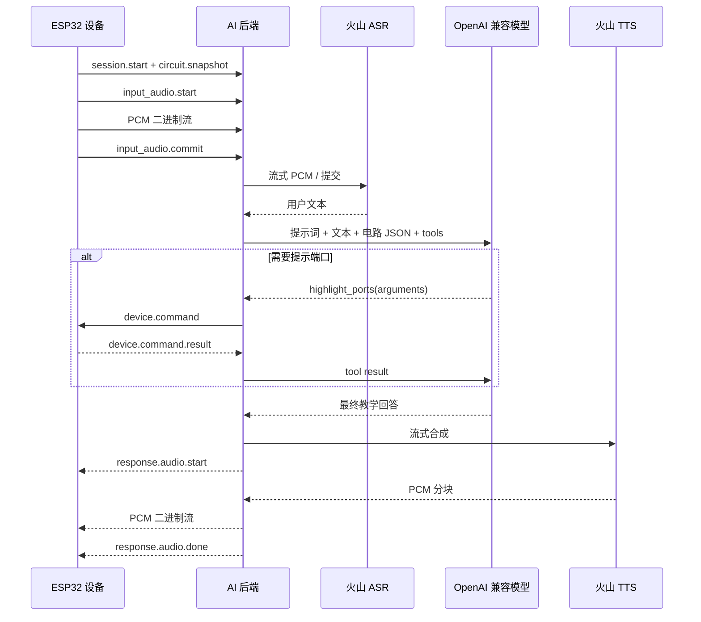

# AI 后端架构设计

## 1. 目标

本项目把 AI 能力从 ESP32-S3-BOX-3B 固件中拆出，形成可独立部署、测试和迭代的服务。后端负责：

1. 接收设备上传的 16 kHz、单声道、S16LE PCM 音频。
2. 调用火山引擎 ASR 得到用户文本。
3. 将用户文本、系统提示词和结构化电路快照发送给 OpenAI 兼容模型。
4. 校验并下发模型产生的设备工具命令。
5. 接收设备执行结果，再让模型生成最终回答。
6. 调用火山引擎 TTS，按设备现有播放节奏流式回传 PCM。

## 2. 明确边界

### 嵌入式端保留

- 长按按键录音、松开提交的 Push-to-Talk 交互。
- 麦克风采集和扬声器播放任务。
- `board_snapshot_t` 的扫描、合法连接和非法连接判定。
- 端口提示灯的实际执行与超时恢复。
- 网络重连、看门狗和设备级错误展示。

### 后端接管

- 系统提示词、教学策略和对话历史。
- ASR、LLM、工具调用和 TTS 编排。
- `board_snapshot_t` 对应 JSON 的版本兼容。
- 工具参数校验、幂等、超时和审计。
- 模型供应商、Base URL、模型名和凭据配置。

### 禁止破坏的稳定边界

固件当前播放链路已经解决卡顿，后端必须适配它，不能要求设备更换播放策略：

```c
audio_self_test_voice_playback_begin();
audio_self_test_voice_playback_push(buffer, size, timeout);
audio_self_test_voice_playback_finish();
audio_self_test_voice_playback_abort();
```

后端 TTS 输出保持 PCM S16LE、16000 Hz、单声道，并持续小块发送。不要把整段音频编码为 Base64 JSON，也不要在播放期间插入控制帧导致数据饥饿。

## 3. 总体流程



## 4. 状态机

每个 WebSocket 连接只处理一个设备，设备同一时刻只允许一个活动会话。

```text
CONNECTED
  -> READY                device.hello
  -> SESSION_ACTIVE       session.start
  -> RECORDING            input_audio.start
  -> THINKING             input_audio.commit
  -> WAITING_TOOL_RESULT  device.command（可选）
  -> SPEAKING             response.audio.start
  -> SESSION_ACTIVE       response.audio.done
```

任意状态发生不可恢复错误时发送 `error`。连接断开时取消 ASR/TTS 请求和未完成工具调用，设备端负责停止录音或调用播放 abort。

## 5. 电路状态

设备不再生成中文电路描述，而是把当前 `board_snapshot_t` 序列化为版本化 JSON。后端完整保留：

- 16 个槽位及元件/逻辑门身份。
- 64 个端口及端口角色。
- 合法连接、非法连接。
- `topology_revision`。
- 扫描计数和诊断字段。

模型提示词中同时提供结构化 JSON 和简短规则说明，不在设备端维护教学提示词。每次语音会话开始时发送一次完整快照；会话期间拓扑变化时再次发送。工具调用必须携带模型决策所依据的 `topology_revision`，防止电路已变化却继续点亮旧端口。

## 6. 工具调用策略

第一版只开放一个工具：

```json
{
  "name": "highlight_ports",
  "arguments": {
    "ports": [8, 21],
    "duration_ms": 3000,
    "pattern": "pulse",
    "reason": "与门缺少第二个输入连接"
  }
}
```

后端强制执行以下规则：

- 端口号为 `0..63`，去重后最多 4 个。
- 持续时间为 `500..10000` 毫秒。
- 模式只能是 `blink` 或 `pulse`。
- 第一版关闭并行工具调用。
- 每个 `call_id` 只能执行一次，重复结果直接复用。
- 工具超时或设备拒绝时，将失败结果回传模型，由模型改用语言说明。

## 7. 模型兼容策略

模型层使用 OpenAI Chat Completions 兼容格式：

- `POST {base_url}/chat/completions`
- `tools` + `tool_choice: auto`
- `parallel_tool_calls: false`
- 工具 schema 使用 `strict: true`
- 第一版工具决策使用 `stream: false`，降低流式增量参数拼接复杂度。

中转站是否支持工具调用不能只看模型名称，应以自动化兼容性测试为准。运行时配置允许修改 Base URL 和模型名，API Key 只保存在环境变量或当前进程内存。

## 8. 可靠性与延迟

- WebSocket 心跳间隔建议 15 秒，45 秒未收到心跳视为断线。
- ASR 在 `input_audio.commit` 后设置硬超时，并区分“无语音”“服务错误”和“网络错误”。
- GPT 工具决策超时建议 45 秒；超时后发送可理解的设备错误状态。
- TTS 首包到达后立即发送 `response.audio.start`，积累足够设备预缓冲数据再开始连续推流。
- 后端按有界队列处理 TTS，生产者快于网络时施加背压，不能无限缓存。
- 每个会话记录 `session_id`、阶段耗时、PCM 字节数和错误码，但不默认记录原始音频或密钥。

## 9. 当前仓库范围

本仓库首个提交提供：

- 协议与嵌入式接入文档。
- OpenAI 兼容模型的工具决策测试 API。
- 运行时配置 API（密钥脱敏）。
- 设备 WebSocket 握手、会话、电路快照和 PCM 提交骨架。
- 浏览器测试台和设备模拟器。

火山 ASR/TTS 的生产适配器按 `docs/implementation.md` 的阶段继续实现。

